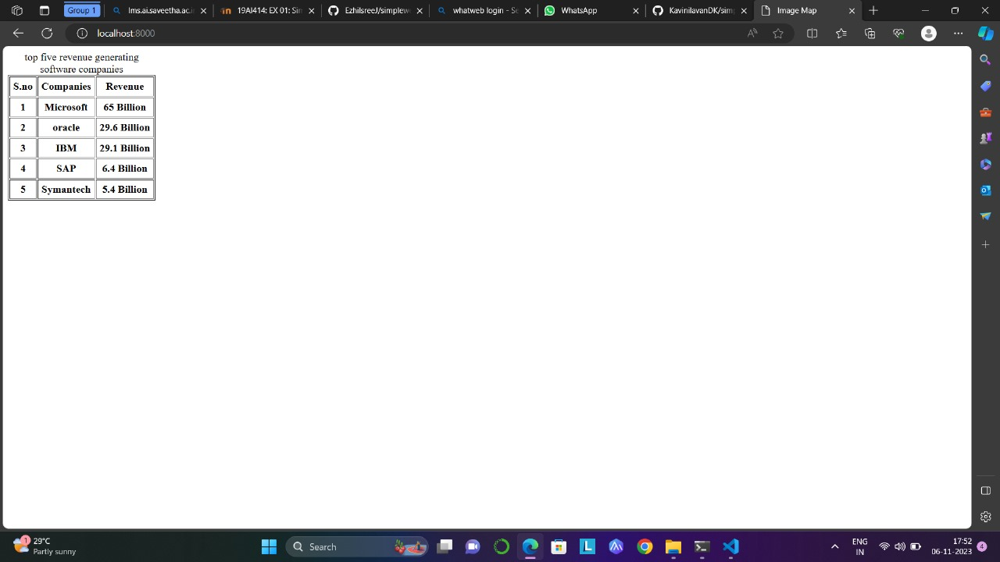

# EX01 Developing a Simple Webserver
## Date:25.10.2023

## AIM:
To develop a simple webserver to serve html pages.

## DESIGN STEPS:
### Step 1: 
HTML content creation.

### Step 2:
Design of webserver workflow.

### Step 3:
Implementation using Python code.

### Step 4:
Serving the HTML pages.

### Step 5:
Testing the webserver.

## PROGRAM:
```
from http.server import HTTPServer, BaseHTTPRequestHandler
content = """
<html>
<title>Image Map </title>
<body>
<table border="1" cellspacing="2" cellpadding="5">
<caption> top five revenue generating software companies </caption>
<tr>
  <th>S.no</th>
<th>Companies</th>
<th>Revenue</th>
</tr>
<tr>
<th>1</th>
<th>Microsoft</th>
<th>65 Billion</th>
</tr>
<tr>
<th>2</th>
<th>oracle</th>
<th>29.6 Billion</th>
</tr>
<tr>
<th>3</th>
<th>IBM</th>
<th>29.1 Billion</th>
</tr>
<tr>
<th>4</th>
<th>SAP</th>
<th>6.4 Billion</th>
</tr>
<tr>
<th>5</th>
<th>Symantech</th>
<th>5.4 Billion</th>
</body>
</html>
"""
class myhandler(BaseHTTPRequestHandler):
    def do_GET(self):
        print("request received")
        self.send_response(200)
        self.send_header('content-type', 'text/html; charset=utf-8')
        self.end_headers()
        self.wfile.write(content.encode())
server_address = ('',8000)
httpd = HTTPServer(server_address,myhandler)
print("my webserver is running...")
httpd.serve_forever()
```

## OUTPUT:

.png)

## RESULT:
The program for implementing simple webserver is executed successfully.
